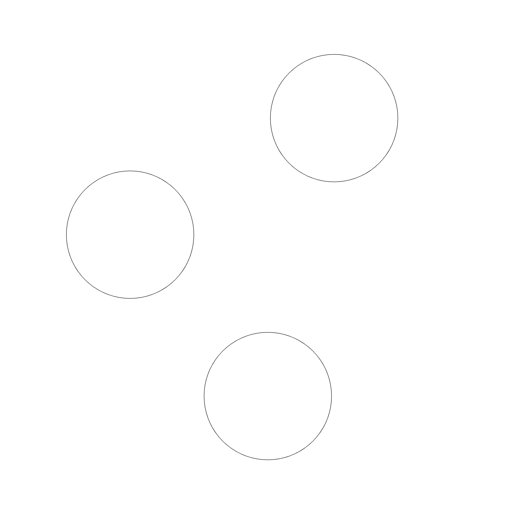

# Final Demo


## Introduction
The task for the final demo is the same as your trial run in M5.

**Task:** Given a random list of 3 fruits contained in [search_list.txt](search_list.txt), your task is to autonomously navigate to the given list of fruits in order, while avoiding obstacles along the way. The robot should stop within 0.5m radius of the target for 3 seconds before moving onto the next target. The following also applies to final demo:
- A true map will be not given in final demo
- You may teleoperate your robot to first generate a map of the arena with your own SLAM, then teleoperate your robot again to estimate the pose of the fruits before running the autonomous fruit search task
- There will be 10 ArUco markers and 7 fruits (3 to search, 4 as obstacles) in the arena. For example, you may need to search 1 x (apple + lemon + orange), then there will be 2x (pear + strawberry) as obstacles
- You may choose to perform manual waypoint navigation (same as [M4 Level 1](../Week08-09/README.md#marking-schemes)) to get some partial marks if you are really struggling to complete the whole task

**Important note:**
- You are not allowed to use true poses of robot or objects retrieved from Gazebo (either by looking at the model information in Gazebo GUI or by using rospy scripts to retrieve poses)
- <span style="color:red">A new ```worlds``` folder has been provided to you.</span> This update will draw 0.5m circles around the fruits on the floor, removing the green circle around the robot that was causing issues with teams. Please place this world folder in ```catkin_ws/src/penguinpi_gazebo/```. <span style="color:red">During marking</span>, you only need to replace ```worlds/materials/textures/texture_ECE4078.jpeg```, which will be provided to you along with the search_list.txt and the true map for Gazebo. **Please try this before your final demo**




---
## Marking

The final demo marking will take place in the Woodside building, room 301, according to this [schedule](https://docs.google.com/spreadsheets/d/1RRQYRsd9qS4vU-5awxtjVpioLZy2QuBN8K3s-tzEt3A/edit#gid=630097384). Here are the deadlines for Moodle submission for the final demo:
- lab1 + lab6 -> Wed 26th Oct 9am
- lab3 -> Thu 27th Oct 9am
- lab4 + lab5 -> Fri 28th Oct 9am

For teams that have decided to get marked earlier, e.g. 101 getting marked on Tue, or 501 getting marked on Thu, please submit your code before your allocated final demo time.

You may choose to do zoom marking, but you will have to notify us at least the day before your scheduled marking time, and you must follow the zoom marking instructions. Note zoom marking is often more time consuming, so please practise the whole marking procedure before your demo. The timer starts at the scheduled time no matter whether you have connected on zoom or not.

### Evaluation <span style="color:red">(Same as M5)</span>
The following point system is the same for both the ```simulation_score``` and the ```robot_score```. We have divided M5 into 3 components:
1. Arena mapping (40pts)
2. Waypoint navigation (10pts)
3. Fruit searching (50pts)

Same as the previous milestones, 
```
final_score = 0.8 x simulation_score + 0.2 x robot_score
```

#### Arena mapping (40pts)
##### SLAM
Before the fruit searching task, you may choose to manually drive the robot around first and create a map as ```slam.txt``` ([M2: SLAM](../Week03-05/)) and the list of detected target poses as ```targets.txt``` ([M3: CV](../Week06-07/)), or you can generate the arena map and the target poses during the autonomous searching task. Eitherway, we will evaulate your ```slam.txt```:

```
mapping_score = (mapping_factor - Aligned_RMSE)/(mapping_factor - 0.02) x 16 + NumberOfFoundMarkers x 0.4
```

where ```mapping_factor = 0.2``` for simulation and ```mapping_factor = 0.15``` for physical robot. The maximum mapping_score is 20pts and minimum mapping_score is 0

##### Target pose estimation
```targets.txt``` should contain the poses of 7 fruits (3x fruit-to-search and 4x obstacle fruits). Similar to M3, the target score for each fruit will be calculated based on the pose estimate error, using

~~~
target_score[fruit] = (1 - estimation_error[fruit])/(1-0.025) x 2.86
~~~

For example, if your robot needs to search for {apple, lemon, orange}, then there will be 2 x {pear, strawberry} as obstacles, and here is an example score 

~~~
target_score[apple_0] = 2.86    # 0 estimation_error
target_score[lemon_0] = 2.86
target_score[orange_0] = 2.86
target_score[pear_0] = 2.86
target_score[pear_1] = 2.86
target_score[strawberry_0] = 1  # some estimation_error
target_score[strawberry_1] = 0  # estimation_error > 1

sum(target_score) = 15.3
~~~

The maximum sum(target_score) is 20pts and minimum sum(target_score) is 0.


#### Waypoint navigation (10pts)
If your robot shows indication of performing waypoint navigation, either through manually entering waypoints or autonomously navigating the arena, and there is evidence of waypoint navigation implementation in your code, then you will receive 10pts. 

#### Fruit searching (50pts)
Your robot has to perform the fruit searching task autonomously in order to get full marks for this sub-task. You will receive 20pts for reaching the first fruit, and 15pts for each of the remaining fruits, which make up a total of 50pts. 

If you choose to do this semi-autonomously (same as M4 Level 1), then you will receieve 40% of the marks (max of 20pts) for this component. You will receive 8pts for reaching the first fruit and 6 pts for each of the remaining fruits.

### Rules
1. Penalty of -2pts for each fruit that the robot collides with

2. Penalty of -5pts for each ArUco marker that the robot collides with

3. Penalty of -5pts each time the robot goes out of the boundary/touches the boundary (+/-1.5m from the origin, in both the x- and y-axis)

4. If you have received three penalties (any of the penalties listed above) during a run, you will receive zero score for that run
	- e.g. zero score for colliding into any object 3 times or collided into 2 objects + out of the boundary once

5. When your robot has stopped moving by itself, you may stop your run, and then your score for that run will be calculated
    - If you stop the run while the robot is moving, or if you manually stop the robot/script, you will receive zero score for that run. This is to prevent teams from stopping the run when the robot reach a fruit by luck

6. The **entire** robot has to be within 0.5m of the target fruit to be considered as a successful collection

7. If the robot reaches the target fruits in the wrong order, you will receive zero score for that run

8. We will check your code to see if you have implemented to appropriate algorithms. To gain credit for the autonomous searching task, we must find evidence of path planning, or obstacle detection and avoidance (respectively) in your code. Successfully collecting fruit and/or avoiding collisions at these levels by luck will not grant you those marks by default

9. When you are manually mapping the arena (if you choose to), you must start at the origin (0, 0, 0)

10. Time limit is **45min** and you may use this time however you want
    - You should end your last run ~2min before the time limit, to allow efficient time to submit the map files
    - For sim only marking, the time limit is **30min**

11. The best run/attempt will be considered as your final score

### Marking procedure

The [marking procedure](../Week10-11/M5_marking_instructions.md) is the same as M5.

